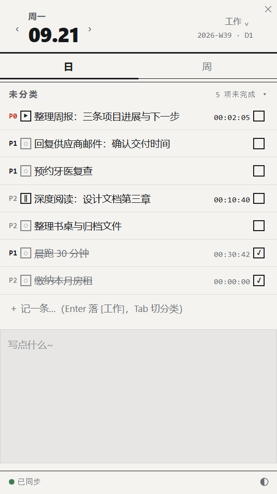

# 日課 (nikka)

**English**: nikka is a Windows desktop sticky to-do widget — day/week linked views, automatic rollover of unfinished tasks, future-date scheduling, and multi-PC sync through your own Git repository. Built with Tauri 2 + Rust + TypeScript. No backend, no accounts: your tasks live as plain markdown files in a repo you own.

Windows 桌面常驻待办贴纸：小窗口贴在桌面一角，日 / 周视图联动，未完成任务跨日自动流转，多台电脑通过你自己的 Git 仓库同步。当前版本 **0.8.4**。



## 功能

- **桌面常驻贴纸**：按住报头拖动，靠近屏幕边缘自动吸附，位置本机记忆；Alt+S 唤起，Esc 或 5 秒无操作沉回桌面层；长清单自动限高可滚动。
- **多笔记本**：点击顶部名称切换、新建或重命名；各笔记本的任务与历史遗留独立保存。
- **日 / 周联动**：日事项自动显示在所属周，日 / 周操作共用同一份任务状态；周视图标出事项来源日期。
- **未来日期预排**：点报头日期跳到任意日期排任务——事项留在所属日期不提前进今天；到期即当天文件，过期未完成自动流转到今天。
- **未完成自动流转**：昨天日任务未勾选自动搬入今天，勾掉即消失，不再手动誊写。
- **任务管理**：优先级 P1/P2/P3、工作 / 个人分类、右键标记 `#doing` / `#blocked`（可附原因）、`#overdue` 只读展示；输入 Enter 保存、Esc 取消、Tab 切分类。
- **7 款主题**：极简黑标、牛皮手帐、奶油横线、鼠尾草格纸、樱粉手帐、午夜墨蓝、雾蓝点阵，仅保存在本机。
- **Git 同步**：本地编辑立即落盘为 markdown（`days/*.md`、`weeks/*.md`）；30 分钟自动同步、可点页脚立即同步、退出时本地 commit 保底；多机并发靠 commit → pull --rebase → push 收敛。
- **单实例**：同一台电脑同时只允许打开一个实例；报头 ✕ 关闭应用。

## 安装（Windows 10/11）

从 [Releases](https://github.com/FiroYu/nikka/releases) 下载：

| 文件 | 说明 |
| --- | --- |
| `nikka-0.8.4-x64-setup.exe` | NSIS 安装包（推荐） |
| `nikka-0.8.4-x64-portable.exe` | 便携版，下载后直接运行 |

依赖 WebView2（Windows 11 自带；Windows 10 缺失时安装包会自动处理）。

## 同步配置（必读）

日課不经过任何第三方服务，任务数据完全存在**你自己的** Git 仓库里：

1. 在 GitHub 新建一个**私有空仓库**（例如 `sticky-sync`）。
2. 首次启动日課，点页脚「**同步设置**」：
   - 仓库地址填 `https://github.com/<你的账号>/<仓库名>`；
   - PAT 填一个只含 `repo` 权限的 [fine-grained token](https://github.com/settings/personal-access-tokens)。
3. 多台电脑填**同一个仓库**，任务自动互通。每台机器的提交身份默认取计算机名，也可用环境变量 `STICKY_MACHINE_TAG` 或 `%APPDATA%\sticky-todo\machine.txt` 自定义（页脚右下角可见，如 `sticky@office:`）。

> 不配置时同步会一直报错（默认地址是占位符）——先完成上面两步即可。仓库地址也可在启动前用环境变量 `STICKY_REPO_URL` 指定；克隆位置默认 `%LOCALAPPDATA%\sticky\sticky-sync`，可用 `STICKY_REPO_DIR` 覆盖。

## 构建

技术栈：Tauri 2 + WebView2 + Vanilla TypeScript + Rust。

```powershell
npm ci
npm run build
cargo build --manifest-path src-tauri/Cargo.toml --release --features custom-protocol
# 或同时生成 Windows NSIS 安装包
npm run tauri -- build --bundles nsis
```

直接运行 cargo 产物时必须带 `--features custom-protocol`，否则程序会去加载开发服务器。

## 开发与验证

```powershell
cargo test --manifest-path src-tauri/Cargo.toml
cargo clippy --manifest-path src-tauri/Cargo.toml -- -D warnings
npm run build
```

CI（`.github/workflows/windows.yml`）在 push 时运行同样的检查并产出 NSIS 安装包。

## License

[MIT](LICENSE)
